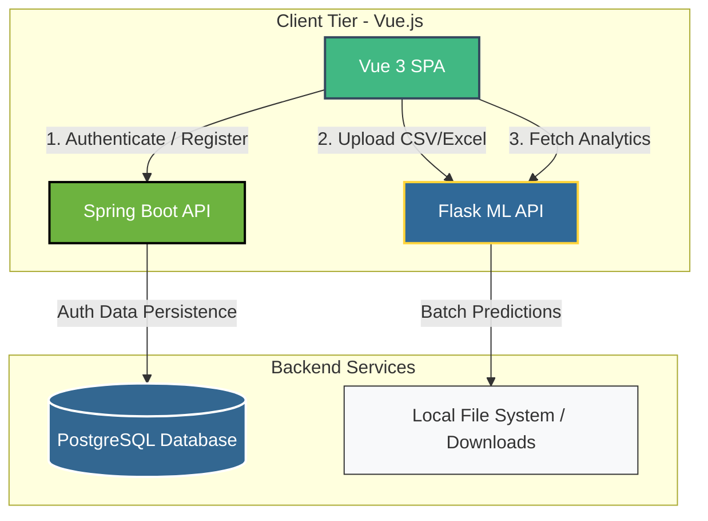

# 📊 Employee Attrition Prediction Platform (EMPALSIS)

Welcome to **EMPALSIS**, a state-of-the-art full-stack platform designed to help organizations analyze, manage, and proactively prevent employee turnover. By leveraging a cohesive multi-service architecture, the platform enables HR professionals to register securely, upload employee datasets, run predictive Machine Learning evaluations, and visualize attrition risks instantly.

Our philosophy is built upon three pillars: **Predict, Prevent, and Prosper**. By detecting early indicators of employee dissatisfaction and turnover, businesses can take targeted retention actions, foster a more engaged workforce, and optimize organizational growth.

---

## 🏗️ System Architecture

EMPALSIS is built on a highly modular **three-tier architecture** with microservices designed to communicate seamlessly:



1. **Client Tier (`Vue_Front-End`)**: An interactive Single Page Application (SPA) styled with Bootstrap 5 and powered by Vuex and Vue-Router. It acts as the user control portal.
2. **Administrative Tier (`Spring_API`)**: A secure Spring Boot REST API backed by a PostgreSQL database, managing HR user registrations, credentials, and authentication logic.
3. **Intelligence Tier (`Flask_API`)**: A Flask-based machine learning server that loads a pre-trained `AdaBoostClassifier`, processes bulk dataset uploads, returns predicted results, and exposes batch statistical analytics.

---

## 🛠️ Technology Stack & Dependencies

### 🟢 Vue 3 Front-End
*   **Core**: Vue 3 (Composition & Options API) powered by Vite.
*   **State Management**: Vuex (for global authentication tracking).
*   **Routing**: Vue-Router (Client-side routing).
*   **HTTP Client**: Axios & Native Fetch.
*   **Styling**: Bootstrap 5 + custom CSS transitions, drag-and-drop file areas, and conic-gradient progress meters.
*   **Utility**: File-saver (triggers immediate downloads for evaluated files).

### ☕ Spring Boot Auth API
*   **Core**: Java 17, Spring Boot 3.x.
*   **Persistence**: Spring Data JPA (Hibernate) mapping Java entities.
*   **Database**: PostgreSQL Database Server.
*   **Libraries**: Lombok (boilerplate reduction), Jakarta Persistence.
*   **Security**: Regular expression validator for email formats and high-strength password policies.

### 🐍 Flask Machine Learning API
*   **Core**: Python 3.
*   **API Framework**: Flask with CORS enabled.
*   **Data Processing**: Pandas, NumPy, openpyxl (Excel parsing).
*   **Machine Learning**: Scikit-Learn.
*   **Model**: Adaptive Boosting (`AdaBoostClassifier`) with 40 estimators and a learning rate of 1.0.

---

## 🧠 Machine Learning & Data Pipeline

The core intelligence layer utilizes predictive algorithms trained on comprehensive, multi-dimensional employee profiles.

### 🧹 Data Preprocessing & Cleaning
*   **Column Filtering**: Features that provide no predictive value—`Over18`, `EmployeeCount`, and `StandardHours`—are automatically discarded.
*   **Categorical Encoding**: All string-based categorical columns are encoded to integer values through mapped representations:
    ```python
    encoding_map = {
        'BusinessTravel': {'Non-Travel': 0, 'Travel_Rarely': 1, 'Travel_Frequently': 2},
        'Department': {'Sales': 0, 'Research & Development': 1, 'Human Resources': 2},
        'Gender': {'Female': 0, 'Male': 1},
        ...
    }
    ```
*   **Feature Scaling**: Attributes are normalized utilizing MinMax Scaling:
    $$\bar{X} = \frac{X - X_{min}}{X_{max} - X_{min}}$$
    This scales all feature values within the bounds of `[0, 1]` to ensure balanced feature weight contribution.

### 📈 Model Evaluation
During system assembly, multiple classifiers were evaluated across a **60/20/20** dataset split (Training, Validation, Testing):
*   **Evaluated Models**: Logistic Regression, Linear Support Vector Classification (SVC), Decision Tree Classifier, and AdaBoost.
*   **Production Choice**: `AdaBoostClassifier` yielded optimal results on the employee dataset, showing resilient performance across F1-score, Precision, Recall, and Accuracy.

---

## 📋 Required Dataset Schema

Bulk file uploads (**CSV or Excel**) must adhere *exactly* to the following 33 column fields to ensure correct feature mapping.

> [!IMPORTANT]
> The dataset must include columns for **`Name`** and **`Surname`**. These columns are extracted dynamically to map individual names to prediction results before compiling the output file.

### Expected Feature Fields:
| # | Column Name | Sample / Value Range |
|---|---|---|
| 1 | **Name** | John |
| 2 | **Surname** | Doe |
| 3 | **Age** | 18 - 60+ |
| 4 | **Business Travel** / **BusinessTravel** | *Non-Travel*, *Travel_Rarely*, *Travel_Frequently* |
| 5 | **Daily Rate** / **DailyRate** | Numeric daily pay rate |
| 6 | **Department** | *Sales*, *Research & Development*, *Human Resources* |
| 7 | **Distance From Home** / **DistanceFromHome** | Distance in miles/km |
| 8 | **Education** | *Below College*, *College*, *Bachelor*, *Master*, *Doctor* |
| 9 | **Education Field** / **EducationField** | *Life Sciences*, *Medical*, *Marketing*, *Technical Degree*, *Human Resources*, *Other* |
| 10 | **Employee Number** / **EmployeeNumber** | Unique employee ID |
| 11 | **Environment Satisfaction** | *Low*, *Medium*, *High*, *Very High* |
| 12 | **Gender** | *Male*, *Female* |
| 13 | **Hourly Rate** / **HourlyRate** | Hourly pay rate |
| 14 | **Job Involvement** | *Low*, *Medium*, *High*, *Very High* |
| 15 | **Job Level** / **JobLevel** | Job hierarchy level (1 - 5) |
| 16 | **Job Role** / **JobRole** | *Sales Executive*, *Research Scientist*, *Laboratory Technician*, *Manufacturing Director*, *Healthcare Representative*, *Manager*, *Sales Representative*, *Research Director*, *Human Resources* |
| 17 | **Job Satisfaction** | *Low*, *Medium*, *High*, *Very High* |
| 18 | **Marital Status** / **MaritalStatus** | *Single*, *Married*, *Divorced* |
| 19 | **Monthly Income** / **MonthlyIncome** | Monthly income in USD |
| 20 | **Monthly Rate** / **MonthlyRate** | Monthly rate metric |
| 21 | **Number of Companies Worked** | Number of previous companies |
| 22 | **Over Time** / **OverTime** | *Yes*, *No* |
| 23 | **Percent Salary Hike** | Percentage value |
| 24 | **Performance Rating** | *Low*, *Good*, *Excellent*, *Outstanding* |
| 25 | **Relationship Satisfaction** | *Low*, *Medium*, *High*, *Very High* |
| 26 | **Stock Option Level** | 0 - 3 |
| 27 | **Total Working Years** | Years active in career |
| 28 | **Training Time Last Year** | Number of training courses taken |
| 29 | **Work Life Balance** | *Bad*, *Good*, *Better*, *Best* |
| 30 | **Years At Company** | Years with the current employer |
| 31 | **Years In Current Role** | Years in current position |
| 32 | **Years Since Last Promotion** | Years since last promotion |
| 33 | **Years With Current Manager** | Years working under the current manager |

---

## 🚀 Setup & Installation Guide

Follow these steps to deploy and run the entire ecosystem locally.

### 1️⃣ Database Setup (PostgreSQL)
1. Ensure you have **PostgreSQL** installed and running on port `5432`.
2. Create a new database named `HR`:
   ```sql
   CREATE DATABASE "HR";
   ```
3. Update the credentials in `Spring_API/src/main/resources/application.properties` if they differ from:
   ```properties
   spring.datasource.username=postgres
   spring.datasource.password=your_password
   ```

### 2️⃣ Running the Spring Boot Backend (`Spring_API`)
1. Open a terminal and navigate to the `Spring_API` directory.
2. Build and run the project using Maven:
   ```bash
   # Windows
   mvnw.cmd spring-boot:run
   
   # Linux/macOS
   ./mvnw spring-boot:run
   ```
   *The server runs on `http://localhost:8080`.*

### 3️⃣ Running the Machine Learning Backend (`Flask_API`)
1. Open a terminal and navigate to the `Flask_API` directory.
2. Install the required Python packages:
   ```bash
   pip install flask flask-cors pandas numpy scikit-learn openpyxl matplotlib seaborn
   ```
3. Run the Flask application:
   ```bash
   python main.py
   ```
   *The server runs on `http://localhost:5000`.*

### 4️⃣ Running the Vue Frontend (`Vue_Front-End`)
1. Open a terminal and navigate to the `Vue_Front-End` directory.
2. Install the Node packages:
   ```bash
   npm install
   ```
3. Boot the Vite development server:
   ```bash
   npm run dev
   ```
   *The application will launch on `http://localhost:5173`.*

---

## 📂 Directory Layout

```
Employee-Attrition-Prediction/
├── Flask_API/                     # Python Machine Learning Microservice
│   ├── main.py                    # Flask server, data pipeline, and model training
│   └── ...
├── Spring_API/                    # Java Authentication & HR Portal Microservice
│   ├── src/                       # Source files (JPA Entities, Services, Controllers)
│   ├── pom.xml                    # Maven configuration and dependencies
│   └── ...
├── Vue_Front-End/                 # Vue 3 Frontend Single Page Application
│   ├── src/                       # Components, Views, Router, and Vuex Stores
│   ├── package.json               # Node.js dependencies
│   └── ...
├── Extended_Proposal.pdf          # Initial project proposal and background research
├── Interim_Report.pdf             # Interim development milestones and metrics
└── Final_Report.pdf               # Comprehensive final project report & review
```

---

## 📄 Project Documentation & Academic Reports

This repository includes academic-grade project reports in the root directory that provide deep insight into the developmental phases:
*   [Extended_Proposal.pdf](file:///c:/Users/kubil/Desktop/Employee-Attrition-Prediction/Extended_Proposal.pdf): Details the problem definition, organizational value proposition, literature review, and proposed solutions.
*   [Interim_Report.pdf](file:///c:/Users/kubil/Desktop/Employee-Attrition-Prediction/Interim_Report.pdf): Reviews midpoint progress, initial model evaluations, feature selection benchmarks, and basic API development steps.
*   [Final_Report.pdf](file:///c:/Users/kubil/Desktop/Employee-Attrition-Prediction/Final_Report.pdf): Presents the finalized full-stack platform, comprehensive evaluation metrics, database schemas, frontend flowcharts, and system validation conclusions.

---

*EMPALSIS — Redefining workforce management and taking a proactive stance against employee attrition.*
